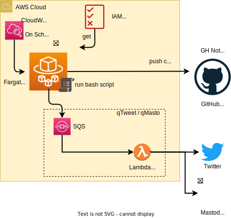

# 🔊 MAMIP - Monitor AWS Managed IAM Policies

[![[Prod] MAMIP - GitHub Actions](https://github.com/z0ph/MAMIP/actions/workflows/main.yml/badge.svg?branch=master)](https://github.com/z0ph/MAMIP/actions/workflows/main.yml)

MAMIP is a tool that monitors changes in AWS Managed IAM Policies and provides automated notifications through multiple channels.

## 🔍 Features

- Automated monitoring of AWS Managed IAM Policies
- Policy validation using AWS Access Analyzer
- Multiple notification channels
- Tracking of deprecated policies
- Serverless architecture using ECS Fargate (Spot)

## 🖐 Usage

### Four Ways to Get Notified

1. **Social Media**
   - [Bluesky](https://bsky.app/profile/mamip.bsky.social)
   - [Twitter/𝕏 Account](https://x.com/mamip_aws)

2. **GitHub Notifications**
   - Enable "Releases Only" notifications

3. **AWS SNS Topic**
   ```bash
   aws sns subscribe \
     --topic-arn arn:aws:sns:eu-west-1:567589703415:mamip-sns-topic \
     --protocol email \
     --notification-endpoint your-email@example.com
   ```

4. **RSS Feed**
   - Subscribe to the [GitHub RSS Feed](https://github.com/z0ph/MAMIP/commits/master.atom)

## ✅ Policy Validation

Each AWS Managed Policy is automatically validated using [AWS Access Analyzer Policy Validation](https://aws.amazon.com/blogs/aws/iam-access-analyzer-update-policy-validation/). Validation findings are stored in the [findings folder](./findings/).

## 👴 Deprecated Policies

The repository maintains a list of [deprecated policies](./DEPRECATED.json) that are no longer actively managed by AWS. Policy validation is only performed on current AWS-managed policies.

## ⏰ Schedule

The monitoring service runs on ECS Fargate (Spot) with configurable schedules. Current settings can be found in the [Terraform configuration](https://github.com/z0ph/MAMIP/blob/master/automation/tf-fargate/variables.tf).

## 📐 Architecture



## 🎖️ Credits

Special thanks to [Scott Piper](https://twitter.com/0xdabbad00) for the original concept. This project extends his idea by:
- Automating the monitoring process
- Adding multiple notification channels
- Implementing policy validation
- Tracking deprecated policies

## 📄 License

This project is licensed under the GNU General Public License v3.0 - see the [LICENSE](LICENSE) file for details.
