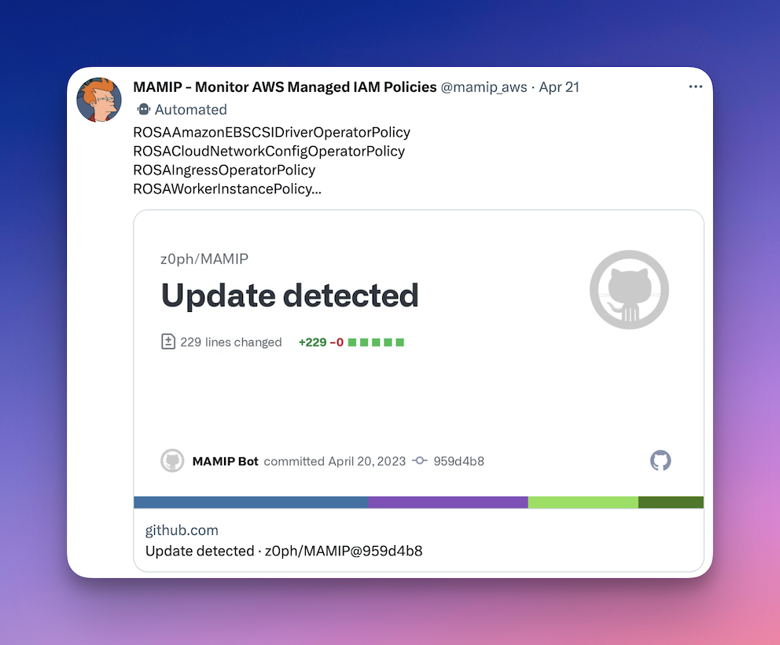

# :loudspeaker: [MAMIP] Monitor AWS Managed IAM Policies

[![[Prod] MAMIP - GitHub Actions](https://github.com/z0ph/MAMIP/actions/workflows/main.yml/badge.svg?branch=master)](https://github.com/z0ph/MAMIP/actions/workflows/main.yml)

## :hand: Usage

### :three: Three options to get notifications

1. Follow the [Twitter Account](https://twitter.com/mamip_aws) or on [Mastodon](https://infosec.exchange/@mamip_aws@botsin.space).

2. Activate `Releases Only` Notification feature of Github

3. Subscribe to the Github [RSS Feed](https://github.com/z0ph/MAMIP/commits/master.atom) (`master` branch)

## :white_check_mark: Policy Validation

[AWS Access Analyzer Policy Validation](https://aws.amazon.com/blogs/aws/iam-access-analyzer-update-policy-validation/) is used on each AWS Managed Policies. You can check findings in the [findings folder](./findings/).

## :older_man: Deprecated Policies

Some AWS Managed Policies are now [deprecated](./DEPRECATED.json) since they first appeared in this repository. Policy validation only takes place on actual AWS-managed policies.

#### :clock1: Schedule

- ECS + Fargate (Spot): [current setting](https://github.com/z0ph/MAMIP/blob/master/automation/tf-fargate/variables.tf#L66-L69)

### :triangular_ruler: Architecture Design

### 🎖️ Credits

Thanks to [Scott Piper](https://twitter.com/0xdabbad00) for the original idea, this product automates the retrieval of new AWS Managed IAM Policies making it easier to monitor and get alerted when changes occur + additional features.
